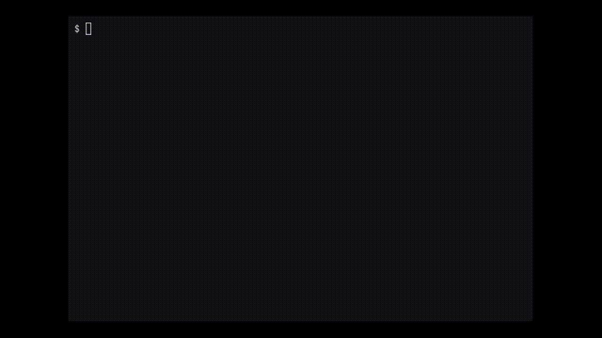

# Rsepl

M4 代码实现, 课程原本要求是写一个 c 语言的 repl, 但我改成了 rust 的 repl.



主要原理:

1. 读取用户输入,使用 rustc --crate-type=cdylib 编译为动态库
2. 使用 dlopen 加载动态库, flag 为 RTLD_NOW | RTLD_GLOBAL
3. 在 eval 的时候使用 dlsym 调用动态库中的函数

目前实现的功能:

1. 加载函数
2. 调用函数求值

限制:

1. 所有函数必须返回 i32
2. 所有表达式必须为一行

```shell
$ cargo run
rsepl> fn gcd(a: i32, b: i32) -> i32 {if b != 0 {gcd(b, a % b)} else {a}}
compile success
rsepl> gcd(256, 144)
result: 16
```
